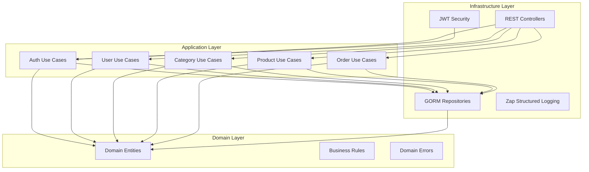
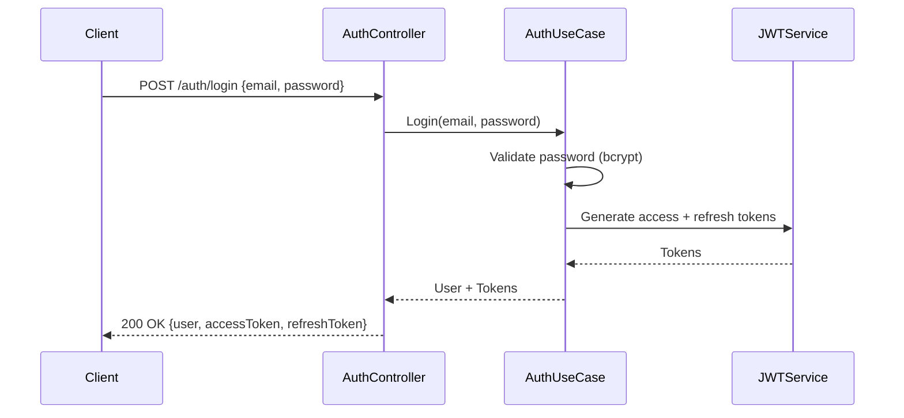

# Ecommerce Microservice — Clean Architecture (Go)

[](https://github.com/gbrayhan/microservices-go/tree/master/.github/ISSUE_TEMPLATE)
[](https://github.com/gbrayhan/microservices-go/network/members)
[](https://github.com/gbrayhan/microservices-go/stargazers)
[](https://github.com/gbrayhan/microservices-go/tree/master/LICENSE)

A production-ready ecommerce microservice built with Go, implementing Clean Architecture principles with JWT authentication, Swagger documentation, and comprehensive CRUD endpoints for users, categories, products, and orders.

## 🏗️ Architecture



### Project Structure

```
src/
├── domain/                     # Domain Layer
│   ├── user/                   # User entity + service interface
│   ├── category/               # Category entity + service interface
│   ├── product/                # Product entity + service interface
│   ├── order/                  # Order + OrderItem entities + service interface
│   └── errors/                 # Domain error types
├── application/usecases/       # Application Layer
│   ├── auth/                   # Login, token refresh
│   ├── user/                   # User CRUD + search
│   ├── category/               # Category CRUD
│   ├── product/                # Product CRUD + filter by category
│   └── order/                  # Order create, list, status update
└── infrastructure/             # Infrastructure Layer
    ├── di/                     # Dependency injection
    ├── repository/psql/        # PostgreSQL repositories (GORM)
    ├── rest/controllers/       # HTTP controllers + Swagger annotations
    ├── rest/routes/            # Route registration
    ├── rest/middlewares/       # JWT auth middleware
    ├── security/               # JWT service
    └── logger/                 # Zap structured logger
```

## 🚀 Quick Start

### Prerequisites

- Go 1.24.2+
- Docker & Docker Compose
- PostgreSQL (via Docker)

### Installation

```bash
# Clone the repository
git clone https://github.com/gbrayhan/microservices-go
cd microservices-go

# Copy environment file
cp .env.example .env

# Start database
docker-compose up -d

# Run the application
make start
```

### Verify

```bash
# Health check
curl http://localhost:8080/v1/health

# Swagger UI
open http://localhost:8080/docs
```

## 📊 API Endpoints

### 🔓 Authentication
| Method | Endpoint | Description |
|--------|----------|-------------|
| POST | `/v1/auth/login` | User login (returns JWT tokens) |
| POST | `/v1/auth/access-token` | Refresh access token |

### 👤 Users (🔒 Auth Required)
| Method | Endpoint | Description |
|--------|----------|-------------|
| GET | `/v1/user/` | Get all users |
| POST | `/v1/user/` | Create user |
| GET | `/v1/user/:id` | Get user by ID |
| PUT | `/v1/user/:id` | Update user |
| DELETE | `/v1/user/:id` | Delete user |
| GET | `/v1/user/search` | Search with pagination |
| GET | `/v1/user/search-property` | Search by specific property |

### 📁 Categories (GET public, write 🔒)
| Method | Endpoint | Description |
|--------|----------|-------------|
| GET | `/v1/category/` | Get all categories |
| POST | `/v1/category/` | Create category 🔒 |
| GET | `/v1/category/:id` | Get category by ID |
| PUT | `/v1/category/:id` | Update category 🔒 |
| DELETE | `/v1/category/:id` | Delete category 🔒 |

### 📦 Products (GET public, write 🔒)
| Method | Endpoint | Description |
|--------|----------|-------------|
| GET | `/v1/product/` | Get all active products |
| POST | `/v1/product/` | Create product 🔒 |
| GET | `/v1/product/:id` | Get product by ID |
| PUT | `/v1/product/:id` | Update product 🔒 |
| DELETE | `/v1/product/:id` | Delete product 🔒 |
| GET | `/v1/product/category/:categoryId` | Get products by category |

### 🛒 Orders (🔒 Auth Required)
| Method | Endpoint | Description |
|--------|----------|-------------|
| POST | `/v1/order/` | Create order (with items) |
| GET | `/v1/order/` | Get my orders |
| GET | `/v1/order/:id` | Get order by ID |
| PUT | `/v1/order/:id/status` | Update order status |

**Order statuses:** `pending` → `paid` → `shipped` → `delivered` → `cancelled`

## 📖 Swagger Documentation

Interactive API docs are available at:

```
http://localhost:8080/docs
```

To regenerate after code changes:

```bash
make swagger
```

## 🔐 Authentication Flow



Use the `Authorization: Bearer <accessToken>` header for protected endpoints.

## 🔧 Development

### Make Commands

```bash
make start           # Run the application
make swagger         # Regenerate Swagger docs
make test            # Run tests
```

### Environment Variables

```bash
# Server
SERVER_PORT=8080

# Database (PostgreSQL)
DB_HOST=localhost
DB_PORT=5432
DB_USER=postgres
DB_PASSWORD=password
DB_NAME=microservices_go
DB_SSLMODE=disable

# JWT
JWT_ACCESS_SECRET_KEY=your_access_secret
JWT_REFRESH_SECRET_KEY=your_refresh_secret
JWT_ACCESS_TIME_MINUTE=60
JWT_REFRESH_TIME_HOUR=24

# Initial Admin User (optional)
START_USER_EMAIL=admin@example.com
START_USER_PW=password123
```

## 🧪 Testing

```bash
# Unit tests
go test ./...

# With coverage
./coverage.sh

# Integration tests
./scripts/run-integration-test.bash
```

## 📄 License

MIT License — see [LICENSE](LICENSE) for details.
